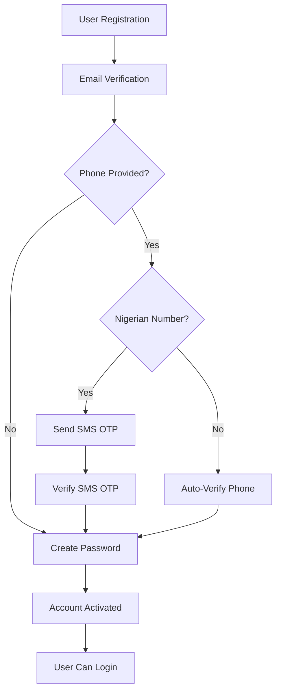

# LiteFi Authentication Flow - Complete Guide

## Overview

The LiteFi authentication system implements a **step-by-step verification process** that ensures security while providing a smooth user experience. This guide covers the complete authentication flow from registration to login.

## Key Features

✅ **No Password at Registration** - Improved security and user experience  
✅ **Email Verification Required** - All users must verify their email  
✅ **Smart Phone Verification** - Nigerian numbers use SMS OTP, international numbers auto-verify  
✅ **Password Creation** - Separate step for better security  
✅ **Hybrid Token Management** - Supports both localStorage and HTTP cookies  
✅ **International Support** - Optimized for global users  

## Authentication Flow Diagram



## Step-by-Step Implementation

### Step 1: User Registration

**Endpoint:** `POST /auth/register`

**Key Points:**
- **No password required** at this stage
- Phone number is optional
- Returns email verification code (testing only)
- International numbers are auto-verified

**Request:**
```json
{
  "email": "user@example.com",
  "firstName": "John",
  "lastName": "Doe",
  "phone": "+2348012345678", // Optional
  "country": "NG" // Optional, defaults to "NG"
}
```

**Response:**
```json
{
  "success": true,
  "message": "Registration successful. Please verify your email to continue.",
  "data": {
    "user": {
      "id": "Dzc_w5IL_P",
      "email": "user@example.com",
      "firstName": "John",
      "lastName": "Doe",
      "emailVerified": false,
      "phoneVerified": true, // Auto-verified for international
      "verified": false,
      "createdAt": "2025-06-16T15:07:07.695Z"
    },
    "verificationCode": "843085" // Only in development
  }
}
```

### Step 2: Email Verification

**Endpoint:** `POST /auth/verify-email`

**Key Points:**
- Required for all users
- Code sent via ZeptoMail
- Must be completed before password creation

**Request:**
```json
{
  "email": "user@example.com",
  "code": "843085"
}
```

**Response:**
```json
{
  "message": "Email verified successfully"
}
```

### Step 3: Phone Verification

#### For Nigerian Numbers

**Send OTP:** `POST /auth/send-phone-otp`
```json
{
  "phone": "+2348012345678"
}
```

**Response:**
```json
{
  "success": true,
  "message": "OTP sent successfully to your phone number",
  "data": {
    "isNigerianNumber": true,
    "requiresOtp": true,
    "verificationId": "VER123456789",
    "phone": "+2348012345678"
  }
}
```

**Verify OTP:** `POST /auth/verify-phone-otp`
```json
{
  "phone": "+2348012345678",
  "verificationId": "VER123456789",
  "otp": "123456"
}
```

#### For International Numbers

**Send Request:** `POST /auth/send-phone-otp`
```json
{
  "phone": "+1234567890"
}
```

**Auto-Verify Response:**
```json
{
  "success": true,
  "message": "International phone number verified automatically",
  "data": {
    "isNigerianNumber": false,
    "requiresOtp": false,
    "phone": "+1234567890",
    "verified": true
  }
}
```

### Step 4: Password Creation

**Endpoint:** `POST /auth/create-password`

**Key Points:**
- Can only be called after email verification
- Returns tokens and activates account
- Sets HTTP cookies automatically

**Request:**
```json
{
  "email": "user@example.com",
  "password": "Password123!"
}
```

**Response:**
```json
{
  "success": true,
  "message": "Password created successfully. You can now access your account.",
  "data": {
    "user": {
      "id": "Dzc_w5IL_P",
      "email": "user@example.com",
      "firstName": "John",
      "lastName": "Doe",
      "emailVerified": true,
      "phoneVerified": true,
      "verified": true,
      "role": "USER",
      "createdAt": "2025-06-16T15:07:07.695Z"
    },
    "accessToken": "eyJhbGciOiJIUzI1NiIsInR5cCI6IkpXVCJ9...",
    "refreshToken": "eyJhbGciOiJIUzI1NiIsInR5cCI6IkpXVCJ9..."
  }
}
```

### Step 5: Login

**Endpoint:** `POST /auth/login`

**Key Points:**
- Only available after complete verification
- Returns tokens and sets cookies
- Supports 2FA if enabled

**Request:**
```json
{
  "email": "user@example.com",
  "password": "Password123!"
}
```

**Response:**
```json
{
  "message": "Login successful",
  "user": {
    "id": "Dzc_w5IL_P",
    "email": "user@example.com",
    "firstName": "John",
    "lastName": "Doe",
    "role": "USER"
  },
  "accessToken": "eyJhbGciOiJIUzI1NiIsInR5cCI6IkpXVCJ9...",
  "refreshToken": "eyJhbGciOiJIUzI1NiIsInR5cCI6IkpXVCJ9..."
}
```

## Frontend Integration Examples

### React/Vue/Angular Implementation

```javascript
class AuthService {
  async register(userData) {
    const response = await fetch('/auth/register', {
      method: 'POST',
      headers: { 'Content-Type': 'application/json' },
      credentials: 'include',
      body: JSON.stringify(userData)
    });
    return response.json();
  }

  async verifyEmail(email, code) {
    const response = await fetch('/auth/verify-email', {
      method: 'POST',
      headers: { 'Content-Type': 'application/json' },
      body: JSON.stringify({ email, code })
    });
    return response.json();
  }

  async sendPhoneOtp(phone) {
    const response = await fetch('/auth/send-phone-otp', {
      method: 'POST',
      headers: { 'Content-Type': 'application/json' },
      body: JSON.stringify({ phone })
    });
    return response.json();
  }

  async verifyPhoneOtp(phone, verificationId, otp) {
    const response = await fetch('/auth/verify-phone-otp', {
      method: 'POST',
      headers: { 'Content-Type': 'application/json' },
      body: JSON.stringify({ phone, verificationId, otp })
    });
    return response.json();
  }

  async createPassword(email, password) {
    const response = await fetch('/auth/create-password', {
      method: 'POST',
      headers: { 'Content-Type': 'application/json' },
      credentials: 'include',
      body: JSON.stringify({ email, password })
    });
    
    if (response.ok) {
      const data = await response.json();
      // Store tokens
      localStorage.setItem('accessToken', data.data.accessToken);
      localStorage.setItem('refreshToken', data.data.refreshToken);
      return data;
    }
    throw new Error('Password creation failed');
  }

  async login(email, password) {
    const response = await fetch('/auth/login', {
      method: 'POST',
      headers: { 'Content-Type': 'application/json' },
      credentials: 'include',
      body: JSON.stringify({ email, password })
    });
    
    if (response.ok) {
      const data = await response.json();
      // Store tokens
      localStorage.setItem('accessToken', data.accessToken);
      localStorage.setItem('refreshToken', data.refreshToken);
      return data;
    }
    throw new Error('Login failed');
  }
}
```

## Validation Rules

### Email Requirements
- Valid email format
- Unique in the system
- Must be verified before password creation

### Phone Number Requirements
- Optional during registration
- Can include country code
- Nigerian numbers: Must be valid Nigerian format
- International numbers: Any valid international format

### Password Requirements
- Minimum 8 characters
- At least 1 uppercase letter
- At least 1 lowercase letter
- At least 1 number
- At least 1 special character

## Error Handling

### Common Error Responses

```json
// User already exists
{
  "statusCode": 409,
  "message": "User with this email or phone already exists"
}

// Invalid verification code
{
  "statusCode": 400,
  "message": "Invalid or expired verification code"
}

// Email not verified
{
  "statusCode": 400,
  "message": "Email must be verified before creating password"
}

// Invalid credentials
{
  "statusCode": 401,
  "message": "Invalid credentials"
}
```

## Security Features

### Token Management
- **Access Token**: 24 hours expiry
- **Refresh Token**: 7 days expiry
- **HTTP Cookies**: Secure, HttpOnly, SameSite
- **Hybrid Storage**: localStorage + Cookies

### Verification Security
- **Email OTP**: Time-limited codes
- **SMS OTP**: Nigerian numbers via KudiSMS
- **Auto-verification**: International numbers for UX
- **Rate Limiting**: Protection against abuse

### Password Security
- **Bcrypt Hashing**: Secure password storage
- **Validation**: Strong password requirements
- **Separate Creation**: Enhanced security flow

## Testing

The authentication flow has been thoroughly tested:

✅ Registration with international phone numbers  
✅ Email verification process  
✅ Phone verification (Nigerian + International)  
✅ Password creation and account activation  
✅ Login with verified accounts  
✅ Token refresh mechanism  
✅ Protected endpoint access  

See `docs/AUTHENTICATION_FLOW_TESTING_RESULTS.md` for detailed test results.

## Migration Notes

If updating from an older authentication system:

1. **Registration**: Remove password field from registration forms
2. **Verification**: Implement email verification step
3. **Phone Handling**: Update to support automatic international verification
4. **Password Creation**: Add separate password creation step
5. **Token Storage**: Implement hybrid cookie/localStorage approach

## Support

For implementation questions or issues:
- Check the Swagger UI at `/api` for endpoint details
- Use the Postman collection for testing
- Refer to test results in the testing documentation
- Review the working test implementation in `test-auth-flow.js` 