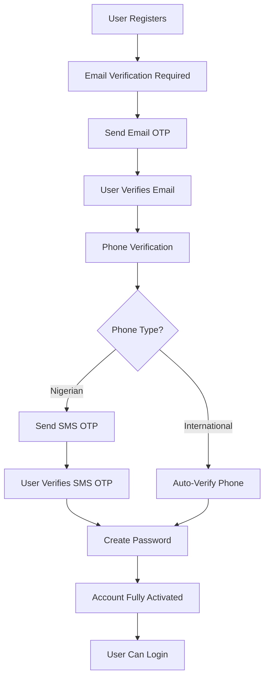

# LiteFi Backend API Documentation for Frontend Integration

This document provides comprehensive documentation of all API endpoints, request bodies, and response formats for frontend integration with the LiteFi Backend.

## Base URL
```
https://your-api-domain.com/api
```

## Hybrid Authentication System

### Overview
The LiteFi Backend implements a **hybrid authentication approach** that supports both cookies (for server-side) and localStorage (for client-side), enabling seamless authentication across different environments:

- **Server-side middleware**: Can read authentication state from HTTP cookies
- **Client-side applications**: Can use localStorage for state management
- **Automatic redirects**: Server-side middleware can redirect unauthenticated users before page load

### How It Works

#### 1. **Dual Token Storage**
When users authenticate (login, register, 2FA), the system:
- **Returns tokens in JSON response** → Client stores in localStorage
- **Sets HTTP cookies automatically** → Server middleware can read authentication state

#### 2. **Token Extraction Priority**
The JWT strategy checks for tokens in this order:
1. **Authorization header** (`Bearer <token>`) → For client-side requests
2. **HTTP cookies** (`auth-token`) → For server-side middleware

#### 3. **Cookie Configuration**
```javascript
// Production settings
{
  httpOnly: true,        // Prevents XSS attacks
  secure: true,          // HTTPS only in production
  sameSite: 'strict',    // CSRF protection
  maxAge: 24 * 60 * 60 * 1000, // 24 hours
  path: '/'
}
```

### Frontend Implementation Guide

#### **For Client-Side Applications (React/Vue/Angular)**
```javascript
// Login request
const response = await fetch('/auth/login', {
  method: 'POST',
  headers: { 'Content-Type': 'application/json' },
  credentials: 'include', // Important: Include cookies
  body: JSON.stringify({ email, password })
});

const data = await response.json();

// Store tokens in localStorage for client-side use
localStorage.setItem('accessToken', data.accessToken);
localStorage.setItem('refreshToken', data.refreshToken);

// Cookies are automatically set by the server
```

#### **For API Requests**
```javascript
// Method 1: Using localStorage token
const token = localStorage.getItem('accessToken');
fetch('/api/protected-route', {
  headers: {
    'Authorization': `Bearer ${token}`,
    'Content-Type': 'application/json'
  },
  credentials: 'include' // Always include for cookie support
});

// Method 2: Cookies only (server-side middleware)
// No Authorization header needed - cookies are automatically sent
fetch('/api/protected-route', {
  credentials: 'include' // Cookies are automatically included
});
```

#### **For Server-Side Middleware (Next.js)**
```javascript
// middleware.ts - Runs on server, can only read cookies
export function middleware(request: NextRequest) {
  const token = request.cookies.get('auth-token')?.value;
  
  if (!token) {
    // Redirect to login before page loads
    return NextResponse.redirect(new URL('/login', request.url));
  }
  
  // Verify token and proceed
}
```

### Security Benefits

1. **XSS Protection**: `httpOnly` cookies cannot be accessed by JavaScript
2. **CSRF Protection**: `sameSite: 'strict'` prevents cross-site requests
3. **Flexibility**: Supports both client-side and server-side authentication
4. **Automatic Management**: Server handles cookie lifecycle automatically

### Logout Endpoint
```javascript
// POST /auth/logout
// Automatically clears both tokens and cookies
fetch('/auth/logout', {
  method: 'POST',
  credentials: 'include'
});

// Clear localStorage on client side
localStorage.removeItem('accessToken');
localStorage.removeItem('refreshToken');
```

## Authentication
Most endpoints require JWT authentication. The system supports two methods:

**Method 1: Authorization Header** (for client-side)
```
Authorization: Bearer <your-jwt-token>
```

**Method 2: HTTP Cookies** (for server-side middleware)
```
// Cookies are automatically included with requests when credentials: 'include' is set
```

## Standard Response Format
All API responses follow this standard format:
```json
{
  "success": true,
  "data": {}, // Response data
  "message": "Operation completed successfully"
}
```

## Error Response Format
```json
{
  "success": false,
  "error": {
    "code": "ERROR_CODE",
    "message": "Error description",
    "details": {} // Additional error details
  }
}
```

---

## Complete Authentication Flow

The LiteFi authentication system follows a step-by-step verification process:

### 1. User Registration Flow



### 2. Step-by-Step Integration Guide

#### Step 1: Register User (No Password)
```javascript
// POST /auth/register
const response = await fetch('/auth/register', {
  method: 'POST',
  headers: { 'Content-Type': 'application/json' },
  credentials: 'include',
  body: JSON.stringify({
    email: 'user@example.com',
    firstName: 'John',
    lastName: 'Doe',
    phone: '+2348012345678', // Optional
    country: 'NG' // Optional
  })
});
```

#### Step 2: Verify Email
```javascript
// POST /auth/verify-email
const response = await fetch('/auth/verify-email', {
  method: 'POST',
  headers: { 'Content-Type': 'application/json' },
  body: JSON.stringify({
    email: 'user@example.com',
    code: '123456' // Code from email
  })
});
```

#### Step 3: Phone Verification
```javascript
// For Nigerian numbers - Send OTP
const otpResponse = await fetch('/auth/send-phone-otp', {
  method: 'POST',
  headers: { 'Content-Type': 'application/json' },
  body: JSON.stringify({
    phone: '+2348012345678'
  })
});

// For Nigerian numbers - Verify OTP
const verifyResponse = await fetch('/auth/verify-phone-otp', {
  method: 'POST',
  headers: { 'Content-Type': 'application/json' },
  body: JSON.stringify({
    phone: '+2348012345678',
    verificationId: 'VER123456789', // From OTP response
    otp: '123456' // OTP from SMS
  })
});

// For International numbers - Auto-verified
// No additional action needed
```

#### Step 4: Create Password
```javascript
// POST /auth/create-password
const response = await fetch('/auth/create-password', {
  method: 'POST',
  headers: { 'Content-Type': 'application/json' },
  credentials: 'include',
  body: JSON.stringify({
    email: 'user@example.com',
    password: 'Password123!'
  })
});

// Response includes tokens and user is fully activated
const { accessToken, refreshToken, user } = response.data;
localStorage.setItem('accessToken', accessToken);
localStorage.setItem('refreshToken', refreshToken);
```

#### Step 5: Login (After Account Activation)
```javascript
// POST /auth/login
const response = await fetch('/auth/login', {
  method: 'POST',
  headers: { 'Content-Type': 'application/json' },
  credentials: 'include',
  body: JSON.stringify({
    email: 'user@example.com',
    password: 'Password123!'
  })
});
```

### 3. Phone Number Handling

#### Nigerian Numbers (`+234...`)
- **Requires SMS OTP verification**
- Must use verification ID from `send-phone-otp` response
- OTP delivered via KudiSMS

#### International Numbers (Non-Nigerian)
- **Automatically verified**
- No SMS required
- Better user experience for global users

### 4. Authentication States

```javascript
// Check user verification status
const user = {
  emailVerified: true,    // Email verified via OTP
  phoneVerified: true,    // Phone verified (SMS OTP or auto)
  verified: true,         // Overall verification status
  hasPassword: true       // Password has been created
};

// User can only login when all verifications are complete
const canLogin = user.emailVerified && user.phoneVerified && user.hasPassword;
```

---

## Authentication Endpoints

All authentication endpoints now support the hybrid approach and automatically set cookies alongside returning JSON tokens.

### POST /auth/register
Register a new user account. **No password required** - password is set later via `/auth/create-password`.

**Request Body:**
```json
{
  "email": "user@example.com",
  "firstName": "John",
  "lastName": "Doe",
  "phone": "+2348012345678", // Optional - include country code
  "country": "NG", // Optional, defaults to "NG" (ISO 2-letter code)
  "referralCode": "REF123456" // Optional
}
```

**Response:**
```json
{
  "success": true,
  "message": "Registration successful. Please verify your email to continue.",
  "data": {
    "user": {
      "id": "Dzc_w5IL_P",
      "email": "user@example.com",
      "firstName": "John",
      "lastName": "Doe",
      "emailVerified": false,
      "phoneVerified": true, // Auto-verified for international numbers
      "verified": false,
      "createdAt": "2025-06-16T15:07:07.695Z"
    },
    "verificationCode": "843085" // Email verification code
  }
}
```

**Important Notes**:
- Registration **does not require a password**
- Returns email verification code (only in development/testing)
- International phone numbers are automatically verified
- Nigerian numbers require SMS OTP verification
- User must complete email verification and password creation to access account

### POST /auth/verify-email
Verify user's email address with the code sent via email.

**Request Body:**
```json
{
  "email": "user@example.com",
  "code": "123456"
}
```

**Response:**
```json
{
  "success": true,
  "message": "Email verified successfully"
}
```

### POST /auth/send-phone-otp
Send OTP to phone number for verification (Nigerian numbers only).

**Request Body:**
```json
{
  "phone": "+2348012345678"
}
```

**Response:**
```json
{
  "success": true,
  "message": "OTP sent successfully to your phone number",
  "data": {
    "verificationId": "VER123456789",
    "phone": "+2348012345678",
    "isNigerianNumber": true,
    "requiresOtp": true
  }
}
```

### POST /auth/verify-phone-otp
Verify phone OTP using verification ID from KudiSMS.

**Request Body:**
```json
{
  "phone": "+2348012345678",
  "verificationId": "VER123456789",
  "otp": "123456"
}
```

**Response:**
```json
{
  "success": true,
  "message": "Phone number verified successfully"
}
```

### POST /auth/create-password
Create password to complete registration and get logged in.

**Request Body:**
```json
{
  "email": "user@example.com",
  "password": "Password123!"
}
```

**Response:**
```json
{
  "success": true,
  "message": "Password created successfully. You can now access your account.",
  "data": {
    "user": {
      "id": "60d5f8b7a2d6c33f24d4b9a5",
      "email": "user@example.com",
      "firstName": "John",
      "lastName": "Doe",
      "emailVerified": true,
      "phoneVerified": true,
      "verified": true,
      "role": "USER",
      "createdAt": "2023-05-29T19:27:19.951Z"
    },
    "accessToken": "eyJhbGciOiJIUzI1NiIsInR5cCI6IkpXVCJ9...",
    "refreshToken": "eyJhbGciOiJIUzI1NiIsInR5cCI6IkpXVCJ9..."
  }
}
```

**Cookies Set:**
- `auth-token`: Contains the access token (24 hours)
- `refresh-token`: Contains the refresh token (7 days)

### POST /auth/resend-otp
Resend email verification OTP. **Updated**: Only handles email OTP now.

**Request Body:**
```json
{
  "email": "user@example.com"
}
```

**Response:**
```json
{
  "success": true,
  "message": "Verification email sent successfully",
  "data": {
    "type": "email",
    "message": "Please check your email for the verification code"
  }
}
```

### POST /auth/send-phone-otp
Send OTP to phone number for verification.

**Request Body:**
```json
{
  "phone": "+2348012345678"
}
```

**Response for Nigerian Numbers:**
```json
{
  "success": true,
  "message": "OTP sent successfully to your phone number",
  "data": {
    "isNigerianNumber": true,
    "requiresOtp": true,
    "verificationId": "VER123456789",
    "phone": "+2348012345678"
  }
}
```

**Response for International Numbers:**
```json
{
  "success": true,
  "message": "International phone number verified automatically",
  "data": {
    "isNigerianNumber": false,
    "requiresOtp": false,
    "phone": "+1234567890",
    "verified": true
  }
}
```

### POST /auth/verify-phone-otp
Verify phone OTP using verification ID (for Nigerian numbers only).

**Request Body:**
```json
{
  "phone": "+2348012345678",
  "verificationId": "VER123456789",
  "otp": "123456"
}
```

**Response:**
```json
{
  "success": true,
  "message": "Phone number verified successfully",
  "data": {
    "phone": "+2348012345678",
    "verified": true
  }
}
```

### POST /auth/login
Login with email and password. **Only available after account is fully verified and password is created**.

**Request Body:**
```json
{
  "email": "user@example.com",
  "password": "Password123!"
}
```

**Response:**
```json
{
  "message": "Login successful",
  "user": {
    "id": "Dzc_w5IL_P",
    "email": "user@example.com",
    "firstName": "John",
    "lastName": "Doe",
    "role": "USER"
  },
  "accessToken": "eyJhbGciOiJIUzI1NiIsInR5cCI6IkpXVCJ9...",
  "refreshToken": "eyJhbGciOiJIUzI1NiIsInR5cCI6IkpXVCJ9..."
}
```

**Cookies Set:**
- `auth-token`: Contains the access token (24 hours)
- `refresh-token`: Contains the refresh token (7 days)

**Prerequisites:**
- Email must be verified
- Phone must be verified
- Password must be created via `/auth/create-password`

### POST /auth/verify-email
Verify email with verification code.

**Request Body:**
```json
{
  "email": "user@example.com",
  "code": "123456"
}
```

### POST /auth/verify-phone
Verify phone number with verification code.

**Request Body:**
```json
{
  "phone": "+2348012345678",
  "code": "123456"
}
```

### POST /auth/resend-otp
Resend OTP code.

**Request Body:**
```json
{
  "email": "user@example.com",
  "type": "email" // or "phone"
}
```

### POST /auth/reset-password
Request password reset.

**Request Body:**
```json
{
  "email": "user@example.com"
}
```

### POST /auth/confirm-reset
Confirm password reset with code.

**Request Body:**
```json
{
  "email": "user@example.com",
  "code": "123456",
  "newPassword": "NewPassword123!"
}
```

### POST /auth/admin/login
Admin login.

### POST /auth/refresh-token
Refresh access token.

**Request Body (Optional):**
```json
{
  "token": "refresh_token_here" // Optional - will use cookie if not provided
}
```

**Note**: This endpoint will first check for the refresh token in the request body, then fall back to reading from the `refresh-token` cookie.

**Response:**
```json
{
  "success": true,
  "data": {
    "accessToken": "eyJhbGciOiJIUzI1NiIsInR5cCI6IkpXVCJ9...",
    "refreshToken": "eyJhbGciOiJIUzI1NiIsInR5cCI6IkpXVCJ9..."
  }
}
```

### POST /auth/logout
Logout user and clear authentication state.

**Request Body:** None required

**Response:**
```json
{
  "success": true,
  "message": "Logged out successfully"
}
```

**Actions Performed:**
- Clears `auth-token` cookie
- Clears `refresh-token` cookie
- Client should also clear localStorage tokens

### POST /auth/login/2fa
Two-factor authentication login.

## Phone Verification Flow

The phone verification process follows this flow:

### For Nigerian Numbers:
1. **Send OTP**: Call `POST /auth/send-phone-otp` with the phone number
2. **Receive SMS**: User receives OTP via SMS
3. **Verify OTP**: Call `POST /auth/verify-phone-otp` with phone, verificationId, and OTP code
4. **Complete**: Phone number is verified and saved to user account

### For International Numbers:
1. **Send OTP**: Call `POST /auth/send-phone-otp` with the phone number
2. **Auto-Verify**: System automatically verifies international numbers
3. **Complete**: Phone number is verified and saved to user account

### Integration Notes:
- Nigerian numbers are detected automatically using the phone number format
- International numbers skip SMS verification for better user experience
- The `verificationId` from the send-phone-otp response is required for Nigerian number verification
- Phone verification can be done independently of user registration
- Once verified, the phone number is associated with the user account

---

## User Management Endpoints

### GET /users/profile
Get the current user profile.
**Authentication:** Required

### PATCH /users/profile
Update the current user profile.
**Authentication:** Required

**Request Body:**
```json
{
  "firstName": "John",
  "lastName": "Doe",
  "phone": "+2348012345678",
  "dateOfBirth": "1990-01-01",
  "gender": "MALE",
  "address": "123 Main Street",
  "city": "Lagos",
  "state": "Lagos",
  "country": "Nigeria",
  "bvn": "12345678901",
  "nin": "12345678901"
}
```

### PATCH /users/employment
Update employment information.
**Authentication:** Required

**Request Body:**
```json
{
  "employmentStatus": "EMPLOYED",
  "employerName": "Tech Company Ltd",
  "jobTitle": "Software Engineer",
  "workAddress": "456 Business District",
  "monthlyIncome": 500000,
  "employmentStartDate": "2020-01-01",
  "workEmail": "john@techcompany.com",
  "workPhone": "+2348012345679"
}
```

### PATCH /users/business
Update business information for business owners.
**Authentication:** Required

**Request Body:**
```json
{
  "businessName": "My Business Ltd",
  "businessType": "TECHNOLOGY",
  "businessAddress": "789 Business Avenue",
  "businessRegistrationNumber": "RC123456",
  "businessPhone": "+2348012345680",
  "businessEmail": "info@mybusiness.com",
  "monthlyRevenue": 2000000,
  "businessStartDate": "2018-01-01"
}
```

### PATCH /users/next-of-kin
Update next of kin information.
**Authentication:** Required

**Request Body:**
```json
{
  "firstName": "Jane",
  "lastName": "Doe",
  "relationship": "SPOUSE",
  "phone": "+2348012345681",
  "email": "jane@example.com",
  "address": "123 Family Street"
}
```

### POST /users/bank-accounts
Add a new bank account.
**Authentication:** Required

**Request Body:**
```json
{
  "bankName": "First Bank",
  "accountNumber": "1234567890",
  "accountName": "John Doe",
  "bankCode": "011"
}
```

### GET /users/bank-accounts
Get all bank accounts for the user.
**Authentication:** Required

### PATCH /users/bank-accounts/:id/default
Set a bank account as default.
**Authentication:** Required

### DELETE /users/bank-accounts/:id
Delete a bank account.
**Authentication:** Required

### POST /users/documents
Upload a document.
**Authentication:** Required
**Content-Type:** multipart/form-data

**Form Data:**
```
type: "ID_DOCUMENT" | "PROOF_OF_ADDRESS" | "BANK_STATEMENT" | "PAYMENT_PROOF" | "SALARY_SLIP" | "BUSINESS_REGISTRATION" | "LOAN_AGREEMENT" | "OTHER"
file: [binary file]
description: "Document description" // Optional
```

### GET /users/documents
Get all documents for the user.
**Authentication:** Required

### DELETE /users/documents/:id
Delete a document.
**Authentication:** Required

### POST /users/change-password
Change user password.
**Authentication:** Required

**Request Body:**
```json
{
  "currentPassword": "CurrentPassword123!",
  "newPassword": "NewPassword123!"
}
```

### POST /users/setup-transaction-pin
Setup transaction PIN.
**Authentication:** Required

**Request Body:**
```json
{
  "pin": "1234"
}
```

### POST /users/verify-transaction-pin
Verify transaction PIN.
**Authentication:** Required

**Request Body:**
```json
{
  "pin": "1234"
}
```

### GET /users/profile-status/investment
Check if profile is complete for investment.
**Authentication:** Required

### GET /users/profile-status/loan
Check if profile is complete for loan.
**Authentication:** Required

---

## Wallet Endpoints

### GET /wallet
Get all wallets.

### GET /wallet/:id
Get wallet by ID.

### GET /wallet/user/me
Get authenticated user wallet.
**Authentication:** Required

### POST /wallet/virtual-account/create
Create virtual account for authenticated user.
**Authentication:** Required

### GET /wallet/virtual-account/details
Get virtual account details for authenticated user.
**Authentication:** Required

### POST /wallet/direct-payment/create
Create direct payment link using Mono.
**Authentication:** Required

**Request Body:**
```json
{
  "amount": 50000,
  "description": "Wallet funding",
  "redirectUrl": "https://yourapp.com/payment-success", // Optional
  "customerName": "John Doe", // Optional
  "customerEmail": "john@example.com" // Optional
}
```

### GET /wallet/mono/public-key
Get Mono public key for client-side integration.

### GET /wallet/transaction/verify/:reference
Verify Mono transaction status.

---

## Investment Endpoints

### GET /investments
Get all investments for authenticated user.
**Authentication:** Required

### GET /investments/plans
Get all available investment plans.

### GET /investments/:id
Get investment details by ID.
**Authentication:** Required

### POST /investments/calculate
Calculate investment returns.

**Request Body:**
```json
{
  "amount": 1000000,
  "tenure": 3,
  "currency": "NGN",
  "upfrontInterestPayment": true
}
```

**Response:**
```json
{
  "success": true,
  "data": {
    "principalAmount": 1000000,
    "tenure": 3,
    "startDate": "2023-06-15",
    "maturityDate": "2023-09-15",
    "interestRate": 0.048,
    "earnings": 48000,
    "withholdingTax": 4800,
    "totalPayout": 1000000,
    "upfrontInterestPayment": true,
    "upfrontInterestAmount": 43200,
    "maturityAmount": 1000000
  },
  "message": "Investment calculation completed successfully"
}
```

**Calculation Details:**

**Interest Calculation Formula:**
```
Total Interest Amount = Investment Amount × Interest Rate Per Month × Tenure (Months)
A × B × C = D

Withholding Tax = Total Interest Amount × 10%
D × 10% = E

Actual Payout = Total Interest Amount - Withholding Tax
D - E = F
```

**For Naira Investments (Regular Payment):**
- **Interest Rate Structure**:
  - 3-5 months: 2.00% per month
  - 6-8 months: 2.00% per month  
  - 9-12 months: 2.00% per month
  - >12 months: 2.00% per month
- **Example**: ₦1,000,000 × 0.02 × 6 months = ₦120,000 total interest
- **Withholding Tax**: 10% of total interest = ₦12,000
- **At Maturity**: User receives principal + interest after tax (₦1,108,000)

**For Foreign Currency Investments:**
- **Interest Rate Structure**:
  - 3-5 months: 1.50% per month
  - 6-8 months: 1.67% per month
  - 9-12 months: 1.80% per month
  - >12 months: 1.90% per month
- **Example**: $5,000 × 0.018 × 9 months = $810 total interest
- **Withholding Tax**: 10% of total interest = $81
- **At Maturity**: User receives principal + interest after tax ($5,729)

**For Naira Investments (Upfront Interest Payment):**
- **Interest Rate**: 1.60% per month (fixed for all tenures)
- **Example**: ₦1,000,000 × 0.016 × 3 months = ₦48,000 total interest
- **Withholding Tax**: 10% of total interest = ₦4,800
- **Upfront Interest**: ₦48,000 - ₦4,800 = ₦43,200 (paid immediately)
- **At Maturity**: User receives only principal amount (₦1,000,000)

### POST /investments
Create a new investment.
**Authentication:** Required

**Request Body:**
```json
{
  "planId": "clq1234567890",
  "amount": 1000000,
  "name": "My Investment Fund",
  "currency": "NGN",
  "agreementAccepted": true,
  "upfrontInterestPayment": true
}
```

**Response:**
```json
{
  "success": true,
  "data": {
    "id": "inv_123456789",
    "reference": "INV-20230615-001",
    "amount": 1000000,
    "currency": "NGN",
    "status": "ACTIVE",
    "upfrontInterestPayment": true,
    "upfrontInterestAmount": 43200,
    "startDate": "2023-06-15T00:00:00.000Z",
    "maturityDate": "2023-09-15T00:00:00.000Z",
    "expectedReturns": 48000,
    "withholdingTax": 4800,
    "plan": {
      "name": "Naira Investment Plan",
      "interestRate": 0.048,
      "duration": 3
    }
  },
  "message": "Investment created successfully"
}
```

**Investment Flow:**

**1. Set Up Investment**
- User enters wealth plan name, amount, and tenure
- System automatically shows interest rate based on tenure and currency
- Minimum tenure is 3 months, users can choose any months ≥ 3

**2. Preview Terms**
The system displays:
- Principal Amount
- Tenure
- Start Date
- Maturity Date
- Earnings (total interest before tax)
- Withholding Tax (10%)
- Total Payouts

**3. Agreement**
- System shows investment agreement
- User must accept agreement (`agreementAccepted: true`)

**4. Payment Methods**
- **For Naira Investments**: Shows wallet balance, proceeds if sufficient funds
- **If insufficient funds**: Shows fund wallet options including Mono DirectPay
- **For Foreign Investments**: Shows account details for transfer

**5. Investment Types:**

**Naira Investments:**
- Funded from user wallet
- Created and activated automatically
- Two payment options: upfront interest or interest at maturity

**Foreign Currency Investments:**
- User transfers to provided account number
- Upload payment proof via `/investments/foreign` endpoint
- Status: "Pending" until admin approval
- Activated manually in backend after verification

**Investment Products:**
- **LiteFi Naira**: NGN-denominated investments
- **LiteFi USD**: US Dollar investments
- **LiteFi GBP**: British Pound investments
- **LiteFi CAD**: Canadian Dollar investments

### POST /investments/foreign
Create a foreign currency investment.
**Authentication:** Required
**Content-Type:** multipart/form-data

**Form Data:**
```
planId: "clq1234567890"
amount: 100000
name: "My USD Investment"
currency: "USD"
agreementAccepted: true
paymentProof: [binary file]
```

**Response:**
```json
{
  "success": true,
  "data": {
    "id": "inv_foreign_123",
    "reference": "INV-USD-20230615-001",
    "amount": 100000,
    "currency": "USD",
    "status": "PENDING",
    "message": "Investment created. Please transfer funds to the provided account and upload payment proof."
  }
}
```

**Foreign Investment Process:**
1. User creates investment
2. System shows account details for foreign currency transfer
3. User uploads payment proof/receipt
4. Investment status: "Pending"
5. Admin reviews and activates in backend
6. Status changes to "Active" after approval

### GET /investments
Get all investments for authenticated user.
**Authentication:** Required

**Response:**
```json
{
  "success": true,
  "data": {
    "active": [
      {
        "id": "inv_123",
        "name": "My Investment",
        "amount": 1000000,
        "currency": "NGN",
        "status": "ACTIVE",
        "dailyGrowth": 533.33,
        "currentValue": 1016000,
        "maturityDate": "2023-09-15T00:00:00.000Z"
      }
    ],
    "closed": [
      {
        "id": "inv_456",
        "name": "Completed Investment",
        "amount": 500000,
        "currency": "NGN",
        "status": "MATURED",
        "finalValue": 540000,
        "canWithdraw": true
      }
    ]
  }
}
```

**Investment Status:**
- **Active**: Includes active investments and matured investments not yet withdrawn
- **Closed**: Completed investments that have been withdrawn
- **Daily Growth**: Shows daily investment growth tracking
- **Manual Withdrawal**: Users must manually withdraw matured investments to wallet

### POST /investments/:id/withdraw
Request investment withdrawal.
**Authentication:** Required

**Request Body:**
```json
{
  "amount": 50000,
  "reason": "Emergency withdrawal"
}
```

**Response:**
```json
{
  "success": true,
  "data": {
    "withdrawalId": "wd_123456",
    "amount": 540000,
    "transferredToWallet": true,
    "newWalletBalance": 1040000
  },
  "message": "Investment withdrawal completed successfully"
}
```

**Withdrawal Process:**
- Available for matured investments
- Transfers funds from investment to user wallet
- Updates investment status to "WITHDRAWN"
- Shows updated wallet balance

---

## Loan Endpoints

### GET /loans
Get all loans for authenticated user.
**Authentication:** Required

### GET /loans/products
Get all available loan products.

### GET /loans/:id
Get loan details by ID.
**Authentication:** Required

### POST /loans/salary
Create a salary loan application.
**Authentication:** Required

**Request Body:**
```json
{
  "productId": "clq1234567890",
  "amount": 500000,
  "duration": 12,
  "purpose": "MEDICAL", // "EDUCATION" | "MEDICAL" | "HOME_RENOVATION" | "DEBT_CONSOLIDATION" | "EMERGENCY" | "OTHER"
  "collateral": {}, // Optional, for loans > 2M
  "documents": [] // Optional
}
```

### POST /loans/working-capital
Create a working capital loan application.
**Authentication:** Required

**Request Body:**
```json
{
  "productId": "clq1234567890",
  "amount": 1000000,
  "duration": 6,
  "purpose": "Business expansion",
  "invoices": [], // Optional
  "collateral": {}, // Optional
  "documents": [] // Optional
}
```

### POST /loans/auto
Create an auto loan application.
**Authentication:** Required

**Request Body:**
```json
{
  "productId": "clq1234567890",
  "amount": 2000000,
  "duration": 24,
  "purpose": "Vehicle purchase",
  "vehicleYear": 2020,
  "vehicleMake": "Toyota",
  "vehicleModel": "Camry",
  "vehicleMileage": 50000,
  "plateNumber": "ABC123XY",
  "collateral": {}, // Optional
  "documents": [] // Optional
}
```

### POST /loans/travel
Create a travel loan application.
**Authentication:** Required

**Request Body:**
```json
{
  "productId": "clq1234567890",
  "amount": 300000,
  "duration": 6,
  "purpose": "Travel expenses",
  "travelPurpose": "Business trip",
  "destinationCountry": "United Kingdom",
  "travelDate": "2023-12-25",
  "collateral": {}, // Optional
  "documents": [] // Optional
}
```

### POST /loans/:id/repayment
Make a loan repayment.
**Authentication:** Required

**Request Body:**
```json
{
  "amount": 50000,
  "paymentMethod": "BANK_TRANSFER",
  "reference": "PMT-12345678"
}
```

---

## Document Endpoints

### GET /documents
Get all documents.

### GET /documents/:id
Get document by ID.

---

## Notification Endpoints

### GET /notifications
Get all notifications for the current user.
**Authentication:** Required

### POST /notifications
Create a notification for the current user.
**Authentication:** Required

**Request Body:**
```json
{
  "title": "Notification Title",
  "message": "Notification message",
  "type": "INFO" // "SUCCESS" | "WARNING" | "ERROR" | "INFO"
}
```

### GET /notifications/:id
Get a notification by ID.
**Authentication:** Required

### PATCH /notifications/:id/read
Mark notification as read.
**Authentication:** Required

### GET /notifications/unread-count
Get unread notifications count.
**Authentication:** Required

### PATCH /notifications/mark-all-read
Mark all notifications as read.
**Authentication:** Required

### POST /notifications/test/:userId
Test endpoint to create a notification for a user.

---

## Admin Endpoints

All admin endpoints require admin authentication and appropriate roles.

### GET /admin/system-health
Get system health status.
**Authentication:** Required (Admin)

### GET /admin/dashboard/summary
Get dashboard summary statistics.
**Authentication:** Required (Admin)

### GET /admin/dashboard/recent-activities
Get recent platform activities.
**Authentication:** Required (Admin)

### GET /admin/dashboard/loan-stats
Get detailed loan statistics.
**Authentication:** Required (Admin)

### GET /admin/dashboard/investment-stats
Get detailed investment statistics.
**Authentication:** Required (Admin)

### GET /admin/users
Get all users with pagination and search.
**Authentication:** Required (Admin)

**Query Parameters:**
- `page`: Page number (optional)
- `limit`: Items per page (optional)
- `search`: Search by name, email or phone (optional)

## Updated Authentication Flow

### 1. User Registration and Setup

#### Register User
```http
POST /auth/register
Content-Type: application/json

{
  "email": "user@example.com",
  "firstName": "John",
  "lastName": "Doe",
  "phone": "+2348012345678",
  "country": "NG"
}
```

**Response:**
```json
{
  "success": true,
  "message": "Registration successful. Please verify your email to continue.",
  "data": {
    "user": {
      "id": "user_id",
      "email": "user@example.com",
      "firstName": "John",
      "lastName": "Doe",
      "emailVerified": false,
      "phoneVerified": false,
      "verified": false
    }
  }
}
```

#### Verify Email
```http
POST /auth/verify-email
Content-Type: application/json

{
  "email": "user@example.com",
  "code": "123456"
}
```

#### Send Phone OTP (Optional - for Nigerian numbers)
```http
POST /auth/send-phone-otp
Content-Type: application/json

{
  "phone": "+2348012345678"
}
```

**Response:**
```json
{
  "success": true,
  "message": "OTP sent successfully",
  "data": {
    "verificationId": "VER123456789",
    "phone": "+2348012345678"
  }
}
```

#### Verify Phone OTP (Optional)
```http
POST /auth/verify-phone-otp
Content-Type: application/json

{
  "phone": "+2348012345678",
  "verificationId": "VER123456789",
  "otp": "123456"
}
```

#### Create Password (Completes Registration)
```http
POST /auth/create-password
Content-Type: application/json

{
  "email": "user@example.com",
  "password": "SecurePassword123!"
}
```

**Response:**
```json
{
  "success": true,
  "message": "Password created successfully. You can now access your account.",
  "data": {
    "user": {
      "id": "user_id",
      "email": "user@example.com",
      "firstName": "John",
      "lastName": "Doe",
      "verified": true
    },
    "accessToken": "jwt_token_here",
    "refreshToken": "refresh_token_here"
  }
}
```

### 2. User Login

#### Standard Login
```http
POST /auth/login
Content-Type: application/json

{
  "email": "user@example.com",
  "password": "SecurePassword123!"
}
```

### 3. Password Management

#### Reset Password Request
```http
POST /auth/reset-password
Content-Type: application/json

{
  "email": "user@example.com"
}
```

#### Confirm Password Reset
```http
POST /auth/confirm-reset
Content-Type: application/json

{
  "email": "user@example.com",
  "code": "123456",
  "newPassword": "NewSecurePassword123!"
}
```

#### Change Password (Authenticated Users)
```http
POST /users/change-password
Authorization: Bearer {access_token}
Content-Type: application/json

{
  "currentPassword": "CurrentPassword123!",
  "newPassword": "NewPassword123!"
}
```

### 4. Email Resending

#### Resend Email Verification OTP
```http
POST /auth/resend-otp
Content-Type: application/json

{
  "email": "user@example.com"
}
```

## Frontend Implementation Guide

### Registration Flow Implementation

```javascript
// Step 1: Register user
const registerUser = async (userData) => {
  const response = await fetch('/auth/register', {
    method: 'POST',
    headers: { 'Content-Type': 'application/json' },
    body: JSON.stringify(userData)
  });
  return response.json();
};

// Step 2: Verify email
const verifyEmail = async (email, code) => {
  const response = await fetch('/auth/verify-email', {
    method: 'POST',
    headers: { 'Content-Type': 'application/json' },
    body: JSON.stringify({ email, code })
  });
  return response.json();
};

// Step 3: Send phone OTP (optional for Nigerian numbers)
const sendPhoneOtp = async (phone) => {
  const response = await fetch('/auth/send-phone-otp', {
    method: 'POST',
    headers: { 'Content-Type': 'application/json' },
    body: JSON.stringify({ phone })
  });
  return response.json();
};

// Step 4: Verify phone OTP (optional)
const verifyPhoneOtp = async (phone, verificationId, otp) => {
  const response = await fetch('/auth/verify-phone-otp', {
    method: 'POST',
    headers: { 'Content-Type': 'application/json' },
    body: JSON.stringify({ phone, verificationId, otp })
  });
  return response.json();
};

// Step 5: Create password (completes registration)
const createPassword = async (email, password) => {
  const response = await fetch('/auth/create-password', {
    method: 'POST',
    headers: { 'Content-Type': 'application/json' },
    body: JSON.stringify({ email, password })
  });
  const data = await response.json();
  
  // Store tokens in localStorage or httpOnly cookies
  if (data.success) {
    localStorage.setItem('accessToken', data.data.accessToken);
    localStorage.setItem('refreshToken', data.data.refreshToken);
  }
  
  return data;
};
```

### Complete Registration Component Example

```javascript
import React, { useState } from 'react';

const RegistrationFlow = () => {
  const [step, setStep] = useState(1); // 1: register, 2: verify-email, 3: phone-otp, 4: verify-phone, 5: create-password
  const [userData, setUserData] = useState({});
  const [verificationId, setVerificationId] = useState('');

  const handleRegister = async (formData) => {
    const result = await registerUser(formData);
    if (result.success) {
      setUserData(formData);
      setStep(2); // Go to email verification
    }
  };

  const handleEmailVerification = async (code) => {
    const result = await verifyEmail(userData.email, code);
    if (result.success) {
      // Check if phone verification is needed (Nigerian numbers)
      if (userData.phone && userData.phone.startsWith('+234')) {
        setStep(3); // Go to phone OTP
      } else {
        setStep(5); // Go to password creation
      }
    }
  };

  const handleSendPhoneOtp = async () => {
    const result = await sendPhoneOtp(userData.phone);
    if (result.success) {
      setVerificationId(result.data.verificationId);
      setStep(4); // Go to phone verification
    }
  };

  const handlePhoneVerification = async (otp) => {
    const result = await verifyPhoneOtp(userData.phone, verificationId, otp);
    if (result.success) {
      setStep(5); // Go to password creation
    }
  };

  const handleCreatePassword = async (password) => {
    const result = await createPassword(userData.email, password);
    if (result.success) {
      // User is now fully registered and logged in
      window.location.href = '/dashboard';
    }
  };

  return (
    <div>
      {step === 1 && <RegisterForm onSubmit={handleRegister} />}
      {step === 2 && <EmailVerificationForm onSubmit={handleEmailVerification} />}
      {step === 3 && <PhoneOtpSendForm onSubmit={handleSendPhoneOtp} />}
      {step === 4 && <PhoneVerificationForm onSubmit={handlePhoneVerification} />}
      {step === 5 && <CreatePasswordForm onSubmit={handleCreatePassword} />}
    </div>
  );
};
```

## Password Requirements

All passwords must meet these requirements:
- Minimum 8 characters
- At least 1 uppercase letter
- At least 1 lowercase letter  
- At least 1 number
- At least 1 special character (@$!%*?&)

## Error Handling

### Common Error Responses

#### User Not Found (404)
```json
{
  "success": false,
  "message": "User not found",
  "statusCode": 404
}
```

#### Invalid Credentials (401)
```json
{
  "success": false,
  "message": "Invalid credentials",
  "statusCode": 401
}
```

#### Email Not Verified (400)
```json
{
  "success": false,
  "message": "Email must be verified before creating password",
  "statusCode": 400
}
```

#### Password Already Set (400)
```json
{
  "success": false,
  "message": "Password has already been set for this account. Use login instead.",
  "statusCode": 400
}
```

#### Invalid OTP (400)
```json
{
  "success": false,
  "message": "Invalid or expired verification code",
  "statusCode": 400
}
```

## Rate Limiting

The following endpoints have rate limiting:
- `POST /auth/register`: 5 requests per 15 minutes
- `POST /auth/send-phone-otp`: 3 requests per 15 minutes
- `POST /auth/verify-phone-otp`: 5 requests per minute
- `POST /auth/resend-otp`: 3 requests per 15 minutes

## Security Features

1. **JWT Authentication**: Access and refresh tokens provided after password creation
2. **Cookie Support**: Tokens automatically stored in HTTP-only cookies
3. **Password Hashing**: bcrypt with 12 salt rounds
4. **OTP Expiry**: Verification codes expire after 15 minutes
5. **Rate Limiting**: Protection against brute force attacks
6. **Input Validation**: Comprehensive validation on all endpoints

## Testing the Flow

You can test the complete registration flow using tools like Postman or curl:

1. Register a user
2. Check email for verification code
3. Verify email with received code
4. (Optional) Send and verify phone OTP for Nigerian numbers
5. Create password to complete registration
6. Use login endpoint to authenticate

The user is now fully registered and can access all authenticated endpoints.
